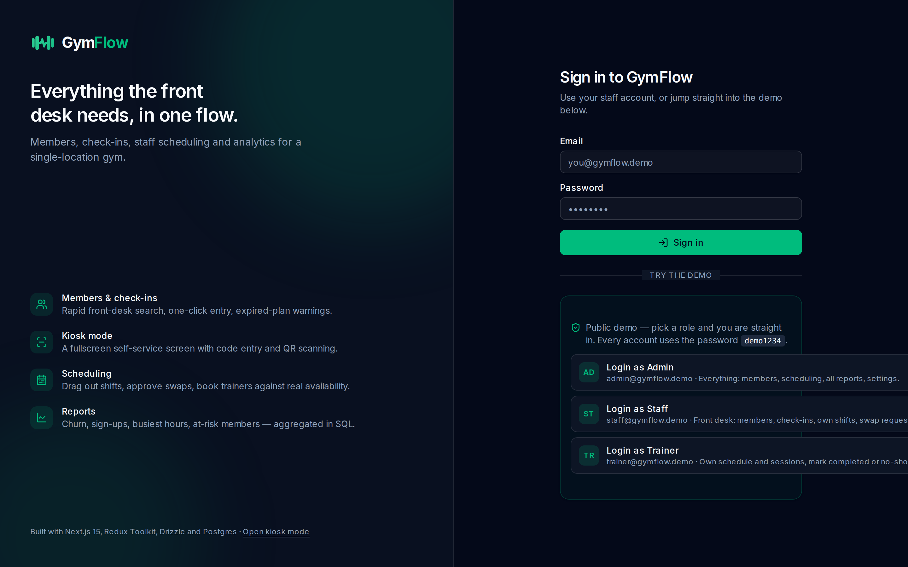
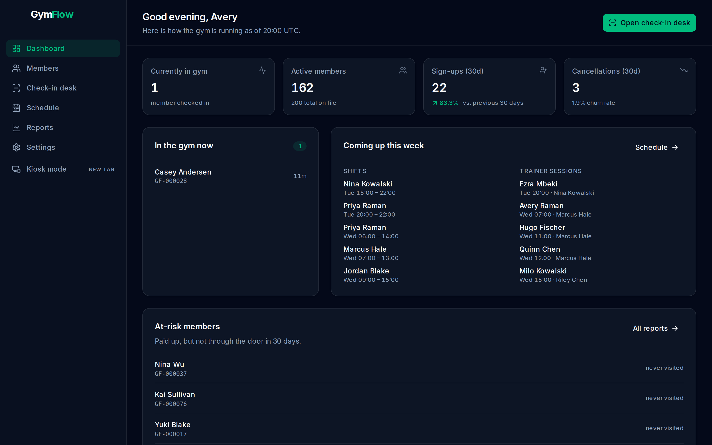
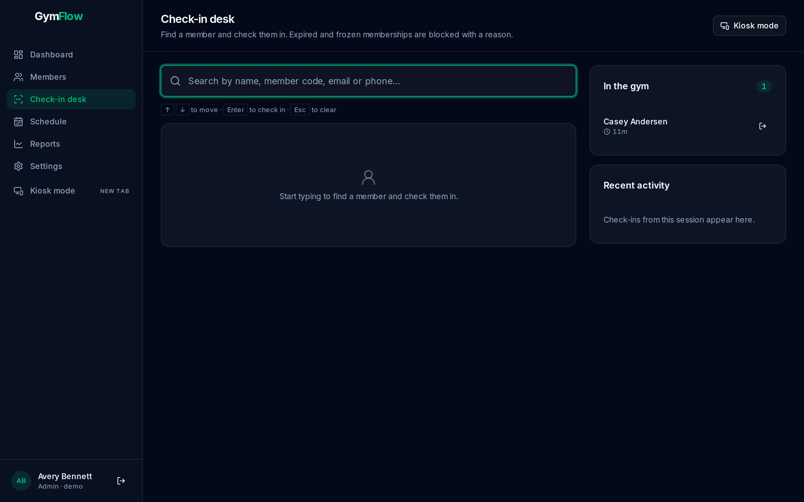
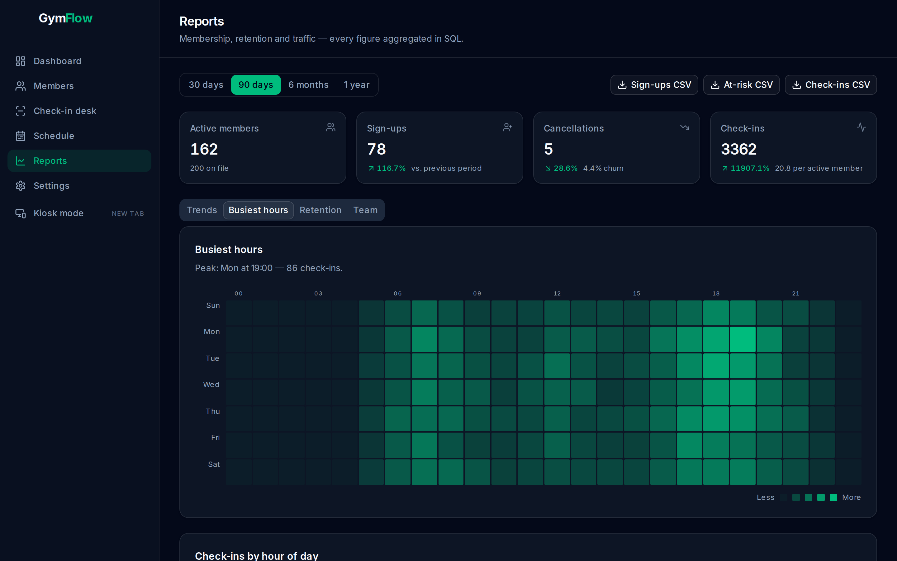
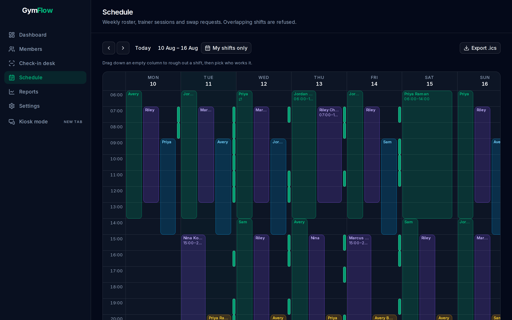
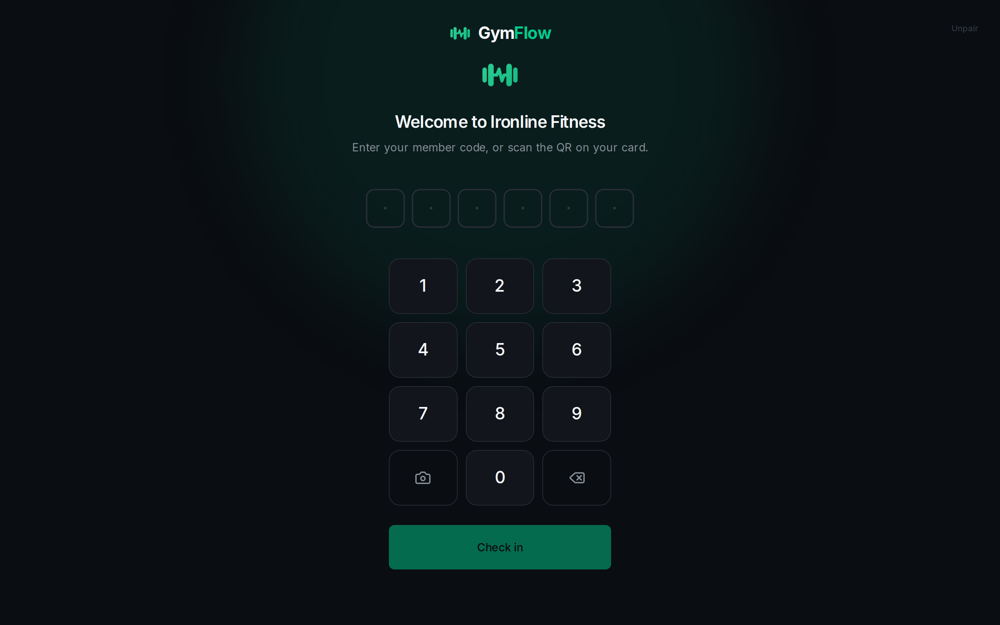

<div align="center">


**Gym management for owners, front-desk staff, and trainers.**
Members and check-ins · staff scheduling · reports that actually mean something.

[**▶ Open the live demo**](https://gymflow-beryl.vercel.app) · [Architecture](ARCHITECTURE.md) · [Kiosk mode](https://gymflow-beryl.vercel.app/kiosk)

</div>

---

## Try it

**https://gymflow-beryl.vercel.app**

The login page has one-click buttons for each role — no typing required. Every
account uses the password `demo1234`.

| Role | Email | What they can do |
|---|---|---|
| **Admin** | `admin@gymflow.demo` | Everything: members, scheduling, all reports, settings |
| **Staff** | `staff@gymflow.demo` | Front desk: members, check-ins, own shifts, swap requests |
| **Trainer** | `trainer@gymflow.demo` | Own schedule and sessions, mark completed or no-show |

The database is seeded with **200 members, ~18,000 check-ins across two years,
four plans, four weeks of roster and 145 trainer sessions**, so every chart has
real shape on the first click. A nightly Vercel Cron job restores the seed, and
a few destructive actions are blocked for demo accounts — see
[Demo guardrails](#demo-guardrails).

> **Kiosk mode** is at [`/kiosk`](https://gymflow-beryl.vercel.app/kiosk). Pair it
> with the token `gfk_demo_front_door_kiosk`, then check in any member — try
> `GF-000007` — with the keypad or the QR scanner.

---

## Screenshots

<div align="center">



*Login — the demo card puts all three roles one click away.*

<br />



*Dashboard — who is in the gym right now, membership health, the week ahead.*

<br />



*Check-in desk — type, arrow down, hit Enter. Expired and frozen memberships are refused with a reason.*

<br />



*Reports — a busiest-hours heatmap, aggregated entirely in SQL.*

<br />



*Schedule — drag out a shift, approve a swap, book a trainer. Overlaps are impossible.*

<br />



*Kiosk — unattended self-service, authenticated by a device token rather than a session.*

</div>

---

## What it does

### Members & check-ins
- Paginated, searchable member list with status, plan and expiry filters
- Member profile with a 90-day attendance chart, plan actions and an audit trail
- Printable **QR member card**, generated server-side
- Front-desk rapid search — name, member code, email or phone — with full
  keyboard control and one-click check-in
- **Expired, frozen and cancelled memberships are blocked**, with a message that
  says what to do about it
- Live "currently in gym" counter and roster, with check-out
- Fullscreen `/kiosk` route: device-token auth, keypad entry, QR camera scanning

### Scheduling
- Weekly calendar grid; concurrent shifts pack into side-by-side lanes
- Admin **drag-to-create** shifts straight on the grid
- Staff **swap requests**; an admin picks the cover, and the reassignment is
  re-checked for conflicts before it lands
- Trainer sessions booked against **derived availability** — a trainer's shifts
  minus what is already booked, so it can never disagree with the roster
- Conflicts surface inline, in plain language
- **iCal export** that subscribes cleanly in Google/Apple Calendar

### Reports
- Membership counts, churn rate and period-over-period deltas
- Sign-ups and cancellations over time
- Check-in trends and a day × hour **busiest-hours heatmap**
- **At-risk members** — paid up, but no visit in 30 days
- Staff hours (scheduled vs. completed) and trainer completion / no-show rates
- Date-range presets and **CSV export** for every table
- All of it aggregated **in SQL** — no folding rows in JavaScript

### Settings
- Plans CRUD, opening hours, kiosk device tokens, staff invites

---

## Stack

| Layer | Choice |
|---|---|
| Framework | Next.js 15 (App Router), TypeScript strict |
| Client state | Redux Toolkit + RTK Query |
| Styling | Tailwind CSS v4 + shadcn/ui |
| ORM | Drizzle ORM |
| Database | Neon Postgres (free tier) |
| Auth | Auth.js v5 (NextAuth), credentials provider, role-based sessions |
| Charts | Recharts |
| Validation | Zod (schemas shared by the API and the client) |
| Hosting | Vercel (free tier), CI/CD on push to `main` |
| Tests | Vitest (use cases) + Playwright (end-to-end) |

**Design language:** deep slate surfaces, one strong primary (emerald `#10B981`)
used consistently, Inter via `next/font`, dark-mode-first.

---

## Architecture

The codebase is organised in explicit layers with a strict dependency rule:
**outer layers depend on inner layers, never the reverse.**

```
/src
  /domain          ← zero framework imports. Entities, value objects, errors.
  /application     ← use cases, repository ports, DTOs. Depends only on /domain.
  /infrastructure  ← Drizzle, Auth.js, QR, iCal. Implements the ports.
  /presentation    ← components and the Redux store.
  /app             ← Next.js routes and /api handlers (the router's fixed home).
  /composition     ← the only place that wires the two worlds together.
```

A few consequences worth calling out:

- **Business rules live in the domain.** "An expired member cannot check in" is
  `Member.canCheckIn(now)` — not an `if` in a route handler. The desk, the
  kiosk and the API all get the same verdict and the same message.
- **Use cases take interfaces, not Drizzle.** There is no database import
  anywhere under `/application`, which is why 46 unit tests run the *real* use
  cases against in-memory fakes in under a second.
- **Route handlers are thin:** parse with a Zod DTO → call a use case → map the
  result or the domain error to a status code.
- **Overlap is impossible, not merely discouraged.** The domain refuses
  overlapping shifts so the UI can explain why; a Postgres `btree_gist`
  exclusion constraint refuses them again so two admins saving at the same
  instant cannot slip past.

**→ [ARCHITECTURE.md](ARCHITECTURE.md)** covers the layers, the Redux split, the
request lifecycle and the testing strategy in full.

---

## Running it locally

**Requirements:** Node 20+, pnpm 9+, and a Postgres database
([Neon](https://neon.tech) has a free tier).

```bash
git clone https://github.com/mosawerghousi/gymflow.git
cd gymflow
pnpm install

cp .env.example .env.local
# Fill in DATABASE_URL, and generate a secret:
#   openssl rand -base64 32   →   AUTH_SECRET

pnpm db:migrate   # schema + the exclusion constraints
pnpm db:seed      # 200 members and two years of history
pnpm dev
```

Open [localhost:3000](http://localhost:3000) and sign in with any account from
the table above.

### Scripts

| Command | Does |
|---|---|
| `pnpm dev` | Dev server (Turbopack) |
| `pnpm build` / `pnpm start` | Production build and serve |
| `pnpm test` | Vitest — domain and use-case tests |
| `pnpm test:e2e` | Playwright end-to-end suite |
| `pnpm typecheck` / `pnpm lint` | TypeScript and ESLint |
| `pnpm db:generate` | Generate a migration from the schema |
| `pnpm db:migrate` | Apply migrations + the manual SQL constraints |
| `pnpm db:seed` | Rebuild the demo dataset |
| `pnpm db:studio` | Drizzle Studio |

`pnpm test:e2e` boots a production build itself. To run it against a
deployment instead:

```bash
E2E_BASE_URL=https://gymflow-beryl.vercel.app pnpm test:e2e
```

---

## Demo guardrails

The app runs on a public URL, so a few things are deliberately fenced off for
the seeded demo accounts:

- Revoking a kiosk token is refused (it would break `/kiosk` for everyone else)
- Passwords cannot be changed
- Seeded records are protected from wholesale deletion
- A **nightly Vercel Cron job** (`/api/cron/demo-reset`, 04:00 UTC) rebuilds the
  seed, so whatever visitors do during the day, the demo looks right the next
  morning

Everything else is fully usable: create members, check people in, renew and
freeze plans, drag out shifts, approve swaps, book sessions, export CSVs.

---

## Verified

| Check | Result |
|---|---|
| Unit tests | 46 passing |
| End-to-end tests (against production) | 25 passing |
| Lighthouse — performance, desktop | **100** on every page |
| Lighthouse — accessibility / best practices | **100 / 100** on every page |
| All three demo roles on the live URL | ✅ |
| Check-in, shift creation, every report | ✅ |
| Nightly demo reset | ✅ verified end to end |

---

## Licence

MIT.
